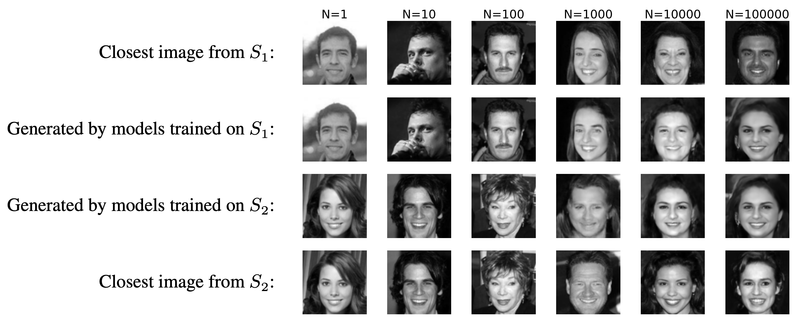
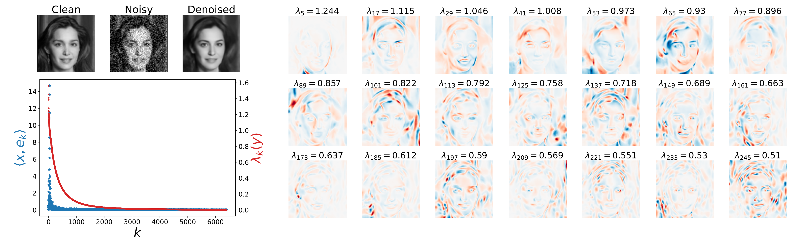

# Generalization in diffusion models arises from geometry-adaptive harmonic representations
ICLR 2024 (accepted as oral):\
[paper on openreview](https://openreview.net/forum?id=ANvmVS2Yr0&referrer=%5BAuthor%20Console%5D(%2Fgroup%3Fid%3DICLR.cc%2F2024%2FConference%2FAuthors%23your-submissions))\
[paper on arXiv (v1: 4 Oct 2023 , v2: 15 Mar 2024)](https://arxiv.org/pdf/2310.02557.pdf) \
Zahra Kadkhodaie, Florentin Guth, Eero P. Simoncelli, Stephane Mallat 

## Contents of this repository:
### 1. Pre-trained denoisers
The [denoisers](denoisers) directory contains several denoisers, trained for removing Gaussian noise from images with the objective of minimizing mean square error. 
All denoisers are universal and "blind": they can remove noise of any standard deviation, and this standard deviation does not need to be specified. 
The [denoisers](denoisers) directory contains a separate folder for each architecture (UNet, BF_CNN), with code specified in [code/network.py](code/network.py). 
Within each architecure directory, there are multiple folders containing variants of that denoiser trained on different datasets.

### 2. Code
The <var>code</var> directory contains the python code for 
- training a universal blind denoiser used in a diffusion framework
- sampling algorithm to sample from the prior embedded in the denoiser
- and all the required helper functions such as
  * code for generating synthetic $C^{\alpha}$ and Disc images
  * code to compute the eigen basis of the denoiser operation
  * etc
### 3. Notebooks
The notebooks folder contains demo code for generating results and figures shown in the paper. 

### Requirements 
You'll need python version 3.9.13 and pytorch 1.13.1 and the following packages to execute the code: \\

os \
time \
sys \
gzip \
skimage 0.19.2 \
matplotlib 3.5.2 \
argparse 1.1 \
scipy 1.9.1 \
PIL 9.2.0 \
pywt 1.3.0

## Summary 
Deep neural networks (DNNs) trained for image denoising are able to generate high-quality samples with score-based reverse diffusion algorithms. But how do they acheive this feat? There are two strategies they can adopt to 
These impressive capabilities seem to imply an escape from the curse of dimensionality, but recent reports of memorization of the training set raise the question of whether these networks are learning the “true” continuous density of the data. Here, we show that two DNNs trained on non-overlapping subsets of a dataset learn nearly the same score function, and thus the same density, when the number of training images is large enough. In this regime of strong generalization, diffusion-generated images are distinct from the training set, and are of high visual quality, suggesting that the inductive biases of the DNNs are well-aligned with the data density.

  

We analyze the learned denoising functions and show that the inductive biases give rise to a shrinkage operation in a basis adapted to the underlying image. Examination of these bases reveals oscillating harmonic structures along contours and in homogeneous regions. We demonstrate that trained denoisers are inductively biased towards these geometry-adaptive harmonic bases since they arise not only when the network is trained on photographic images, but also when it is trained on image classes supported on low-dimensional manifolds for which the harmonic basis is suboptimal. Finally, we show that when trained on regular image classes for which the optimal basis is known to be geometry-adaptive and harmonic, the denoising performance of the networks is near-optimal.
 

  

## Cite 
@inproceedings{ \
kadkhodaie2024generalization, \
title={Generalization in diffusion models arises from geometry-adaptive harmonic representation}, \
author={Zahra Kadkhodaie and Florentin Guth and Eero P Simoncelli and St{\'e}phane Mallat}, \
booktitle={The Twelfth International Conference on Learning Representations}, \
year={2024}, \
url={https://openreview.net/forum?id=ANvmVS2Yr0} \
}
